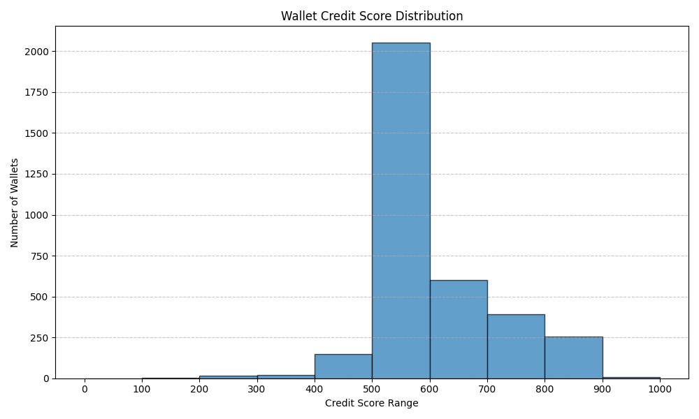

# Wallet Credit Score Analysis

This analysis provides insights into the distribution and behavior of DeFi wallets based on their assigned credit scores (0-1000).

## Score Distribution

The following histogram shows the distribution of wallet credit scores, binned in ranges of 100:



```python
import pandas as pd
import matplotlib.pyplot as plt

scores = pd.read_csv('wallet_scores.csv')['credit_score']
bins = list(range(0, 1100, 100))
plt.figure(figsize=(10,6))
plt.hist(scores, bins=bins, edgecolor='black', alpha=0.7)
plt.title('Wallet Credit Score Distribution')
plt.xlabel('Credit Score Range')
plt.ylabel('Number of Wallets')
plt.xticks(bins)
plt.grid(axis='y', linestyle='--', alpha=0.7)
plt.tight_layout()
plt.savefig('score_distribution.png')
plt.show()
```

## Summary Statistics

- **Total wallets scored:** 3499
- **Mean score:** 585.78
- **Median score:** 523
- **Min score:** 170
- **Max score:** 904

## Behavior Analysis

### Wallets in Lower Score Range (0-300)
- **Characteristics:**
  - High number of liquidations or high liquidation rate
  - Low or no repayments relative to borrows
  - High borrow-to-deposit ratio (risky behavior)
  - Short activity span or few transactions
  - Possible bot-like or exploitative patterns

### Wallets in Higher Score Range (700-1000)
- **Characteristics:**
  - Frequent deposits and regular repayments
  - Low or zero liquidations
  - High repay-to-borrow ratio (responsible usage)
  - Longer activity span, consistent engagement
  - Indicate reliable and responsible DeFi users

## Interpretation
- **Most wallets** cluster around the mid-to-high score ranges, indicating generally responsible behavior.
- **Lower scores** are strong indicators of risky or undesirable activity, while **higher scores** reflect reliability and good protocol citizenship.

---
